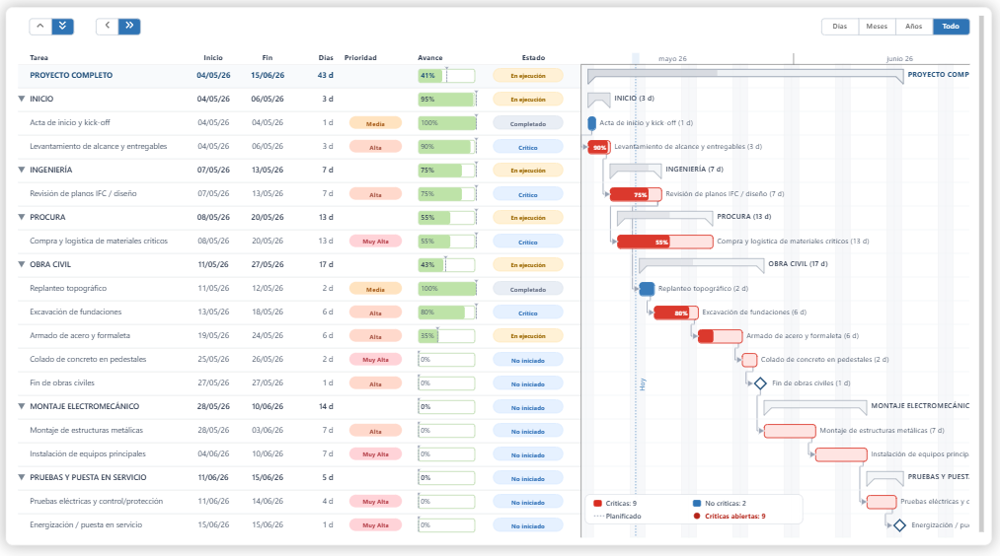

# GANTT CHART 02 — EJECUTIVO  
### Power BI + Deneb + Vega

Visual avanzado de cronograma ejecutivo desarrollado en **Deneb + Vega para Power BI**, orientado a:

- Construcción
- Infraestructura
- EPC
- PMO
- Project Controls
- Líneas de transmisión
- Subestaciones
- Seguimiento ejecutivo de proyectos

---

# Vista General

Este visual fue diseñado para transformar el Gantt tradicional en una herramienta visual ejecutiva enfocada en:

✅ seguimiento de avance  
✅ lectura rápida para comité  
✅ priorización de actividades  
✅ identificación de tareas críticas  
✅ control visual de desviaciones  
✅ navegación dinámica  
✅ dependencias visuales  

El objetivo principal fue crear un visual más limpio, ejecutivo y práctico para toma de decisiones reales en proyectos de construcción e infraestructura.

---

# Vista del Visual



---

# Reconocimiento y Base de Desarrollo

Este visual ha sido desarrollado tomando como base e inspiración la propuesta original de Gantt creada por **Davide Bacci** para **Deneb + Vega en Power BI**.

A partir de dicha propuesta se realizaron múltiples personalizaciones, mejoras funcionales y ajustes visuales orientados específicamente a:

- Project Controls
- PMO
- Construcción
- Infraestructura
- Seguimiento ejecutivo
- Dashboarding avanzado
- Experiencia visual para comité

Se reconoce y agradece el trabajo original de Davide Bacci como base técnica de esta evolución personalizada.

---

# Mejoras Incorporadas

## Experiencia Ejecutiva

- Diseño optimizado para PMO
- Mejor lectura ejecutiva
- Menor saturación visual
- Hover optimizado
- Mejor navegación temporal

---

## Gestión Visual

- Agrupadores en escala de grises
- Mejor contraste de prioridades
- Estados más visibles
- Barras críticas diferenciadas
- Mejor separación visual de fases

---

## Navegación

- Zoom dinámico con rueda del mouse
- Vista por:
  - Días
  - Meses
  - Años
  - Proyecto completo
- Paneo horizontal y vertical
- Botones rápidos de navegación
- Doble clic para reiniciar vista

---

## Dependencias

- Soporte para múltiples dependencias
- Resaltado visual automático
- Secuencia dinámica de relaciones
- Compatibilidad con estructuras complejas

---

# Features

## Seguimiento de Proyecto

✅ Avance real  
✅ Avance planificado  
✅ Variación de avance  
✅ Ruta crítica  
✅ Priorización visual  
✅ Estados operativos  

---

## Prioridades Visuales

Incluye categorías:

- Baja
- Media
- Alta
- Muy Alta

Con colores optimizados para lectura ejecutiva.

---

## Estados Operativos

Estados dinámicos:

- No iniciado
- En ejecución
- Completado
- Crítico
- Retrasado
- Vigilancia

---

# Tecnologías Utilizadas

- Power BI
- Deneb
- Vega (validar schema del JSON antes de publicar nueva version)
- JSON Specification

---

# Instalación

## 1. Instalar Deneb

Instalar el visual **Deneb** desde AppSource en Power BI.

---

## 2. Crear Visual Deneb

Agregar el visual Deneb al reporte.

---

## 3. Crear Nueva Especificación

Dentro de Deneb seleccionar:

```text
New Specification → Vega
```

4. Pegar Archivo JSON

Abrir el archivo:

Gantt Ejecutivo 1.0 Spec.json

y pegar el contenido dentro del editor de Deneb.

# Estructura de Datos

La tabla debe contener la siguiente estructura:

| Columna | Tipo | Descripción |
|---|---|---|
| id | Texto/Número | Identificador único |
| fase | Texto | Nombre de fase |
| tarea | Texto | Nombre de tarea |
| hito | Boolean | Define si es hito |
| inicio | Fecha | Fecha inicio |
| fin | Fecha | Fecha fin |
| avance | Número | % avance real |
| avance_planificado | Número | % avance planificado |
| predecesoras | Texto | IDs separados por coma |
| responsable | Texto | Responsable |
| prioridad | Texto | Baja / Media / Alta / Muy Alta |
| estado | Texto | Estado operativo |
| enlace | Texto | Hipervínculo opcional |
| proyecto | Texto | Nombre proyecto |
| ruta_critica | Boolean | Indicador de ruta crítica |

---

# Configuración

## Signals Configurables

| Signal | Descripción |
|---|---|
| showTooltips | Activar/desactivar tooltips |
| initDate | Fecha inicial |
| showButtons | Mostrar botones |
| startGrain | Escala inicial |
| initPhaseState | Estado inicial filas |
| initColumnState | Estado inicial columnas |
| yRowHeight | Altura filas |
| taskColumnWidth | Ancho columna tarea |
| statusColumnWidth | Ancho prioridad |
| progressColumnWidth | Ancho avance |

---

# Casos de Uso

Ideal para:

- EPC
- Construcción
- Infraestructura
- Líneas de transmisión
- Subestaciones
- PMO
- Project Controls
- Valor Ganado
- Curva S
- Seguimiento ejecutivo

---

# Buenas Prácticas

✅ Mantener IDs únicos  
✅ Mantener formatos consistentes  
✅ Evitar exceso de dependencias  
✅ No usar jerarquías automáticas de fechas  
✅ Utilizar nombres claros de fases y tareas  

---

# Estructura Recomendada del Repositorio

```text
GANTT CHART 02 - EJECUTIVO/
│
├── README.md
├── gantt_chart_02_ejecutivo.json
├── Gantt Ejecutivo 1.0 Thumbnail.png
└── sample-data/
    └── Gantt_Demo_Table.xlsx
```

---

# Créditos

## Desarrollo y Personalización

**Ing. Walter Iván Guerrero**

Basado en propuesta inicial desarrollada por **Davide Bacci**

Especialista en:

- Project Management
- Project Controls
- Power BI
- IA aplicada
- Automatización
- Dashboards ejecutivos

---

# LinkedIn

www.linkedin.com/in/ing-walterguerrero


---

## Auditoria De Mejora Continua

Esta ficha resume la evaluacion del visual desde tres perfiles de uso.

| Perfil | Necesidad principal | Estado actual | Siguiente mejora recomendada |
|---|---|---|---|
| Ejecutivo | Ver ruta critica, desviacion y prioridades rapidamente. | Bueno | Mantener vista compacta y reforzar indicadores criticos. |
| Analista Power BI | Reutilizar el JSON con datos propios. | Requiere ajuste | Reconstruir dataset demo y validar schema Vega. |
| Gerente de proyecto | Identificar tareas criticas y responsables. | Bueno | Mejorar tooltip con responsable, estado y desviacion. |

## Mejoras Priorizadas

| Prioridad | Mejora | Impacto |
|---|---|---|
| Alta | Reconstruir `Gantt_Demo_Table.xlsx`, actualmente sin datos detectables. | Permite probar el visual sin friccion. |
| Alta | Validar schema del JSON, porque el archivo declara Vega v1 y la documentacion mencionaba Vega v5. | Evita incompatibilidades en Deneb. |
| Alta | Alinear README, JSON y Excel con los mismos nombres de columnas. | Reduce errores de configuracion. |
| Media | Agregar indicadores ejecutivos sugeridos: criticas abiertas, desviacion y proximos hitos. | Aumenta valor para comites. |
| Baja | Crear version compacta para slides o presentaciones. | Mejora uso ejecutivo. |

Consulta el detalle completo en [IMPROVEMENTS.md](IMPROVEMENTS.md).

---

## Version JSON Optimizada

Se genero una variante conservadora para mantenimiento y validacion:

- [Gantt Ejecutivo 1.1 Optimized Spec.json](Gantt%20Ejecutivo%201.1%20Optimized%20Spec.json)
- [JSON_AUDIT.md](JSON_AUDIT.md)

La version optimizada conserva la logica visual original, actualiza el schema a Vega v5 y agrega metadatos de compatibilidad. Antes de reemplazar el spec principal, debe validarse en Deneb con un dataset demo funcional.
